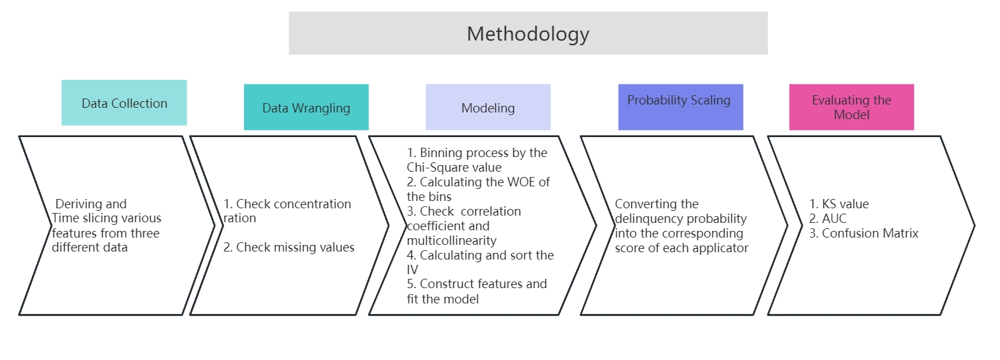
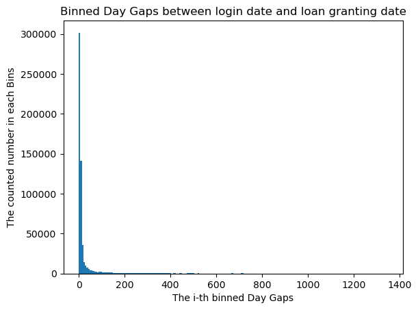
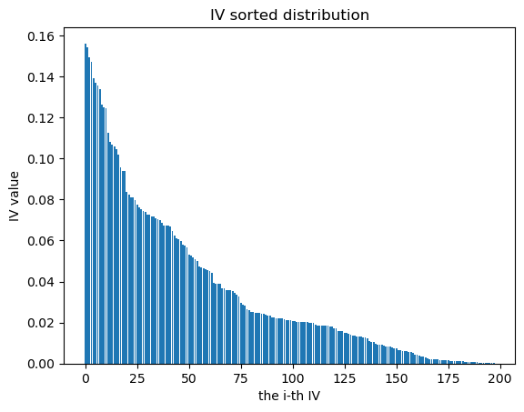

# Section 1 Preface    
This model predicts the delinquency probability of the credit card applicant samples by using Chi-Square Binning with Logistic Regression Algorithm. Furthermore the system then scores the applicant samples bases on their probability.


## 1.1 Data  
The data mainly consists of three parts. Part 1 is the applicant's login information, Part 2 is the applicant's own attribute information, including the applicant's Idx, place of residence, third-party information, and default information "target", Part 3 is the applicant's modified information.
 
## 1.2 The concept of Chi-Square(χ2) binning
This model adopts the data binning technique. This technique categorizes similar samples into one bin. The basis for determining similarity is to calculate the Chi-Square values of two adjacent bins of the samples and their corresponding p-values. The smaller Chi-Square value, the more similarity.

### The benefits of Chi-square binning technology:

A. The model is stable. Minor changes in sample values do not affect the performance of the model. For example, a slight change in applicant’s income will not affect the predicted score of the sample.

B. Missing value data does not affect the result. For missing value data, they can be directly categorized in one bin.

C. Model can handle the categorical features.

D. Reducing the number of features. For example, according to one-hot method, the original feature of “province” which was designed to indicate the resident province of the applicants, will be converted into more than 30 features. However, with binning, several provinces with similar bad sample rates can be merged into one bin for processing, thereby reducing the number of features.

### Disadvantages:  
A. Has impact on accuracy rate  
B. If the original feature data has monotonicity, it may not be able to maintain monotonicity after binning. For example, in terms of education, generally speaking, the higher the education , the lower the default rate. So we should keep attention to maintain this monotonicity after binning.
 

## 1.3 The WOE and IV calculating   
(1) After binning, calculate the WOE of each bin to encode the features. WOE measures how much the proportion of good to bad in this bin exceeds the overall good to bad ratio. Namely:

WOE=ln (G1/G/B1/B)=ln (G1/B1/G/B)=(lnG1/B1) - (lnG/B)
If WOE >0, it indicates that the bad sample rate of the bin is lower than the average bad sample rate of the entire sample (that is, ln(G1/B1) is greater than ln(G/B))

(2) In addition to calculating WOE, it is also necessary to calculate the IV value. The IV value measures the importance of features.

IV = (G1/G - B1/B) * WOE
 


# Section 2 Data Collection   
## Deriving features from data  
Time slicing according the number of days between the login date and the loan disbursement date in Data Part 1. There are 7 days, 30 days, 60 days, 90 days, 120 days, 150 days, and 180 days to calculate the total and average number of logins in each time slicing;  
  
Similarly, time slicing the number of days between the information updated date and the loan disbursement date for data Part3, and calculating the number and frequency.
  
# Section 3 Data Wrangling 
## 3.1 Check the outlier of categorical feature and numerical feature  
This step is mainly about data filling and checking the concentration ratio of data.  
(1) Check concentration ratio. Check the proportion of the maximum value in each feature. If the data concentration ratio is greater than 90% and there is no significant difference (i.e. (minority value bad sample rate/maximum value bad sample rate)<=10). This indicates excessive concentration rate. We need to cancel this feature.  
(2) Check for missing values. For categorical or numerical features, if more than 80% are missing, delete them.  
(3) If the missing value is less than 80%, the category feature will be assigned a value of -1, and the numerical feature will be assigned a random non missing value in this column.  


# Section 4 Modeling
## 4.1 Basic processing flow


(1)Binning by function called ChiMerge  
(2)After ChiMerge function was finished, check the monotonicity of the bad sample rate of these bins. If monotonicity is not satisfied, merge the bins by the Monotone_Merge function until monotonicity is satisfied.  
(3)Check if there is the proportion of a single value in each feature exceeding 90%. if yes , then deleting this feature.

## 4.2 Categorical features and numerical features are processed separately.
(1) Categorical features with large number of different values were needed to be encoded and converted into numerical features according the bad ratio, and then be processed as the ordinary numerical features binning.  
(2) Replace the feature name with the original name+  “_Encoding”, and then the feature will be directly be processed in the numerical feature binning.  
(3) Category features with fewer values do not need to be binned, but it is necessary to check whether the bad sample rate for each categorical value equals to 0  
(4) If the bad sample rate equals to 0, merged with the bin which has the lowest bad sample rate by the function called MergeBad0. After the processing, the feature name needs to be replaced with: original name+"_mergeByBadRate"  
(5)Check if there is the proportion of a single value in each feature exceeding 90%. if yes , then deleting this feature.  
(Note: monotonicity check is not required For categorical features because monotonicity cannot be checked for categorical features.)

## 4.3 The detail of ChiMerge binning processing:  
#### (1) ChiMerge function:    


A. Group and sort the values in the feature.  
B. merge the first and second bins, and merge the second and third bins,etc..., Merge the previous bin with the last bin and calculate their bin-merged Chi-Square value.  
C. Find the minimum Chi-Square value. Assuming that the merged Chi-Square value of the second and third bins is the smallest, replace this 2nd and 3rd bins with the new bin.  
D. Continuing merge until the generated number of new bins is less than or equal to 5, then can end the processing.  

#### (2) Merging the Zero_Bad_Sample_rate function：    
Check whether each bin contains both good and bad samples (note: only being processed in numerical feature)  
 

A. If the bin is found that there are only good or bad samples, it is necessary to merge with adjacent bin.  
B. If it is the first or last bin has the only good or bad samples, it is simple and can be merged with adjacent bin.    
C. If the bin is in the middle, it is necessary to calculate the chi-square with the left or right bin separately, later to select the smallest Chi-Square value binning scheme. Then to judge whether the situation of only good or bad has been eliminated. If yes, then end the loop. If no, then continue the loop.  


## 4.4 Monotone_Merge function  
(Monotonicity judgment)
flow chart:
 

How to judge whether it is not monotonous?   
If it is not monotonous, it is generally because the bad sample rate in a certain bin is higher or lower than the bad sample rate of the front and rear bins. At this time, it can be merged with the front bin or with the rear bin. Which bin is the best to be merged with? Which bin can be merged so that this action can eliminate the situation of non-monotonicity and the binning shows more evenly?  

Moreover, in the case of non-monotonicity , it is usually more than one bin shows non-monotonic. This means that there are several bins in the whole features , the bad sample rate of these bins is higher or lower than that of their front and rear bins.

The purpose of this program is to select the best solution for bin merging in this situation. The steps are as follows:  
(1) If the number of non-monotonicity bins is greater than or equal to 2, for each non-monotonicity bin, for example, the i-th bin, the function attempts to merge it with adjacent front and real bins separately, and call the sub-function(named “Merge_ adjacent_Rows”) to determine whether this i-th bin is merged with the front or rear bin better. After finishing, the new bins are required to be monotonous and be more balancing.  
(2) After merging each non-monotonicity bin with the front or real bin, the function should then use the original resting data from other bins to re-calculate the non-monotonic value and equilibrium value of this new merging scheme. These new schemes are all recorded in a list named all_ possible_ Merge. (Note: Newly merged data from other bins cannot be used for this re-calculation, as it is not yet known whether the new data from other merged bins is the best solution and whether their solutions should be used.)  
(3) After re-calculating all non-monotonic binning , the function finds the smallest non monotonic value and the most balancing value solution in the list(all_ possible_ Merge), and using this solution as the only best binning scheme.  
(4) Recalculating the whole features to judge whether this best binning scheme is still non-monotonic. If Yes and the number of bins is greater than 2, then repeating the above steps until there is non-monotonic or only 2 bins are selected.  

## 4.5 Results of binning  
(1) Main output after binning: var_ WOE, var_ IV, var_ cutoff   
where:
var_ Cutoff: The corresponding cutting point for each bin  
var_ WOE: After binning, the corresponding WOE value for each bin  
var_ IV: IV value of each feature    
(2) for the categorical feature, the function will output a new feature which will be named: name of the original feature + “_ Encoding”  according to this feature’s bad sample rate.  

## 4.6 Single-feature and multi-features analysis 
Firstly,  remove those features with smaller IV values.
After that, check the linear correlation between each features through the np. corrcoef function.
And computing the VIF of multicollinearity test for each features.

## 4.7 Fit the Logistic regression model  
Using the fit() function to fit the model by using the statsmoodels.api libray.

However, when the first fit operation, it was found that some features have larger p-values and thus have poorer significance; Additionally, it was found that some coefficients in the logistic regression model are positive and do not meet the business requirements.

Therefore, the first step is to separately extract each feature from the total features, from large to small, one by one for single logistic regression processing, to check the significance and whether the coefficients are correct.

Through the single practice,  it was found that when each feature was processed separately, the p-values was very small and significant, and the coefficients were not positive. It then can be judged that some results are affected by the linear correlation and multicollinearity of other features, which lead to a large p value or a positive coefficient when they are processed together.

Therefore, to ensure the model meets business requirement, we should firstly sort the IV values of the feature with descending order, and then one by one by adding the IV value of features to a list to fit the logistic regression model and to judge whether the p-value is less than 0.1 and the coefficient is less than 0.     

If YES, then append this tested feature to a list named 'select_var’, if No, then delete this feature. As a result, in the end of this processing all features in this list can be ensured to have sufficient significance and positive coefficients. 

The features in this list are the final features that can be finally to fit the logistic regression model. The training samples are then trained to fit the logistic regression model.

The results are as follows:
```
                                 Results: Logit
================================================================================
Model:                    Logit                Pseudo R-squared:     0.090      
Dependent Variable:       target               AIC:                  14343.1946 
Date:                     2023-05-08 10:53     BIC:                  14492.7558 
No. Observations:         30000                Log-Likelihood:       -7153.6    
Df Model:                 17                   LL-Null:              -7860.2    
Df Residuals:             29982                LLR p-value:          2.1653e-290
Converged:                1.0000               Scale:                1.0000     
No. Iterations:           8.0000                                                
--------------------------------------------------------------------------------
                                Coef.  Std.Err.     z     P>|z|   [0.025  0.975]
--------------------------------------------------------------------------------
ThirdParty_Info_Period2_6_WOE  -0.3365   0.0845   -3.9806 0.0001 -0.5021 -0.1708
ThirdParty_Info_Period6_6_WOE  -0.1520   0.0826   -1.8405 0.0657 -0.3138  0.0099
ThirdParty_Info_Period5_6_WOE  -0.1596   0.0808   -1.9756 0.0482 -0.3180 -0.0013
UserInfo_14_encoding_WOE       -0.8311   0.0699  -11.8922 0.0000 -0.9681 -0.6942
ThirdParty_Info_Period1_15_WOE -0.3201   0.0849   -3.7695 0.0002 -0.4865 -0.1537
ThirdParty_Info_Period3_15_WOE -0.1551   0.0904   -1.7155 0.0863 -0.3323  0.0221
ThirdParty_Info_Period6_1_WOE  -0.7511   0.0838   -8.9579 0.0000 -0.9154 -0.5867
UserInfo_16_encoding_WOE       -0.8410   0.1015   -8.2822 0.0000 -1.0400 -0.6420
WeblogInfo_4_WOE               -0.6369   0.0842   -7.5641 0.0000 -0.8019 -0.4719
ThirdParty_Info_Period2_8_WOE  -0.4876   0.0967   -5.0397 0.0000 -0.6772 -0.2979
UserInfo_7_encoding_WOE        -0.9477   0.0909  -10.4320 0.0000 -1.1258 -0.7697
WeblogInfo_20_encoding_WOE     -0.7385   0.0887   -8.3261 0.0000 -0.9123 -0.5647
UserInfo_17_WOE                -0.8146   0.1202   -6.7783 0.0000 -1.0502 -0.5791
ThirdParty_Info_Period1_10_WOE -0.8349   0.1326   -6.2938 0.0000 -1.0948 -0.5749
ThirdParty_Info_Period2_10_WOE -0.4266   0.1387   -3.0753 0.0021 -0.6984 -0.1547
WeblogInfo_2_encoding_WOE      -0.5928   0.1174   -5.0506 0.0000 -0.8229 -0.3628
UserInfo_12_WOE                -0.5470   0.1721   -3.1777 0.0015 -0.8844 -0.2096
intercept                      -2.5351   0.0241 -105.0953 0.0000 -2.5824 -2.4878
================================================================================
```

# Section 5 Probability scaling  

This step converts the delinquency probability of each sample into the corresponding score.
Equation 
Score of person = base score + PDO * (- y)/ln (2)
Where:
p- Probability of customer delinquency
y=- log (p/(1-p))

PDO: Point to Double odds. It means when the good to bad ratio increases by 1 time, the score increases by one PDO unit

The equation can ensure that:  
(1) When the probability of good to bad decreases by one time, the score increases by one basic unit, that is one PDO.  
(2) Ensure positive scores  

Case:  
When a customer's delinquency probability is 20%, the good to bad ratio is 4 (80%/20%), and the score is 200;  
When a customer's delinquency probability is 11% and the good to bad ratio is 8 (89%/11%), the score is 300 (an increase of 1 PDO);  


# Section 6 Evaluating the Model
The KS 
KS can tell the ability of differentiation  of the model. Usually KS is required: >=30%
 

  

The AUC
The AUC can tell the ability of prediction. Usually AUC is required: >=70%

  

at last , the PSI can tell the stability of the model. Usually PSI is required: <= 0.25

# Section 7 Areas to be improved in this model  
A.The different methods of deriving features from data can have a significant impact on the results.  
B. There are other better ways to derive features. In the modeling processing, features such as the number and frequency of operations within different time slicing are mainly derived from the applicant's information, logging in, and other operations. However, on the contrary, such as income, education, those information we believe to have more important impact on the judgement of whether an applicant will be delinquent were not be mentioned. So how to increase those important data is very import step to improve the accuracy of the model.   
C. Although there are so many procedures to create the model, the original model had a bug which did not split the data into testing data and training data. The following version has fixed this bug. 

# Section 8 How to improve the credit card risk control in business by the result of this model  
A. Focus on features with high importance to the model.  
B. Pay attention to the changes of these important features in each customer throughout the entire credit card life cycle, including the application stage, normal transaction stage, and re-judge stage. Specifically, the credit card center in the bank can label each customer based on these features and track these feature of each customer in the entire credit card life style.  
C. Beyond the technology, sometimes we also pay attention to common sense, such as the affection from the economy development cycle.

# Section 9 Appendix  
The following image shows the results of the code running on Jupyter Notebook

A. The 1st image:



B. The 2nd image:



C. The 3rd image:


D. The 4th image:


E. The 5th image:


F. The 6th image:


G. The 7th image:


